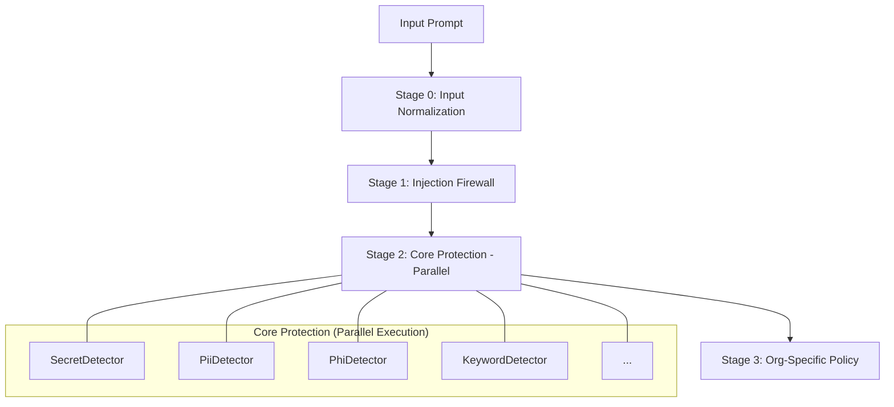

# 🛡️ PromptGuard — Enterprise AI Firewall

> A Chrome/Edge/Brave/Firefox browser extension that intercepts every prompt sent
> to AI tools (ChatGPT, Gemini, Copilot, Claude), scans for sensitive data,
> and blocks, redacts, or alerts — all logged to a PostgreSQL database with
> a real-time Enterprise Security Dashboard.

---

## 🎯 What We Are Trying to Achieve

As organizations adopt Generative AI, they face a critical **Data Security Gap**. Sensitive information — ranging from PII and Health Data (PHI) to Internal Secrets and Source Code — is frequently leaked through LLM prompts.

**PromptGuard's Objective:**
1.  **Prevent Data Leakage:** Ensure no sensitive corporate or customer data leaves the perimeter.
2.  **Mitigate Jailbreaks:** Protect against prompt injections and adversarial attacks that try to bypass security constraints.
3.  **Enforce Corporate Policy:** Transition from "wild west" AI usage to governed, policy-backed interactions.
4.  **Full Auditability:** Provide security teams with a forensic trail of every prompt, its risk score, and the enforcement action taken.

---

## ⚙️ How It Works: The 3-Stage Intelligent Shield

PromptGuard doesn't just look for keywords. It uses a **multi-stage security funnel** to evaluate risks in real-time.

### 1. Layer 0: Input Normalization (Defense against Obfuscation)
The first line of defense. The system standardizes text by removing common obfuscation tactics (e.g., `s-s-n`, `p.a.s.s.w.o.r.d`, `j a i l b r e a k`) before it reaches the detection engines. This ensures that attackers cannot bypass security by simply adding separators.

### 2. Layer 1: Deterministic Pattern Matching (Regex)
High-speed scanning for known formats with 100% confidence. This includes Credit Cards, SSNs, API Keys, Wallet Addresses, and known jailbreak strings.

### 3. Layer 2: Semantic Intent Analysis (Intent-Based)
The "Intelligence Layer." It looks for the *behavior* and *context* of the prompt (e.g., persona roleplay, instruction overrides, or "sharing" intent) rather than just keywords. This layer uses the normalized text stream for high-precision detection.

> [!NOTE]
> **Performance First:** To maintain sub-millisecond latency, the sync-LLM (Ollama) layer has been superseded by high-performance L1/L2 parallel architecture in v14.


### 3. Policy Enforcement Engine
Based on the risk score (0-100), the engine takes immediate action:
*   ✅ **ALLOW:** Safely passes the prompt through.
*   ⚠️ **ALERT:** Logs the event and shows a warning notification.
*   ✏️ **REDACT:** Strips sensitive data (e.g., `[REDACTED-PII]`) and sends only the safe text.
*   🚫 **BLOCK:** Completely stops the prompt and alerts the user.

---

## ⚡ Performance Optimization (v14)

The **v14 Update** introduced the **Single-Pass Parallel Architecture** to resolve high-latency bottlenecks and CPU congestion.

| Metric | Before Optimization (Sequential) | After Optimization (Parallel + L0) |
| :--- | :--- | :--- |
| **Detection Speed** | Serial Loop (Blocking) | **Multi-Threaded Parallel Execution** |
| **Total Latency** | ~3,500ms | **< 300ms** |
| **Obfuscation Resistance** | Vulnerable (e.g. "s-s-n") | **Robust (Layer 0 Normalization)** |
| **Concurrency** | Fighting Threads | **High-Throughput Task Orchestration** |
| **UX Stability** | High risk of extension timeout | **Invisible, real-time security** |

---

## 📁 Project Structure

```
promptguard/
├── extension/                     ← Load this folder in Chrome/Edge/Brave
│   ├── manifest.json
│   ├── background.js              ← Service worker: heartbeat, role check, browser detect
│   ├── content.js                 ← Intercepts prompts on AI sites
│   ├── icons/
│   │   ├── icon16.png
│   │   ├── icon48.png
│   │   └── icon128.png
│   └── popup/
│       ├── popup.html             ← Extension popup UI
│       └── popup.js               ← Tabs: Test / Settings / Admin
│
├── frontend-dashboard/
│   └── index.html                 ← Open in any browser — no server needed
│
├── backend/
│   ├── pom.xml
│   └── src/main/
│       ├── resources/
│       │   ├── application.properties
│       │   └── schema.sql
│       └── java/com/promptguard/
│           ├── config/            ← DatabaseInitializer (migration + user seeding)
│           ├── controller/        ← REST API endpoints
│           ├── detector/          ← PII / PHI / Secret / Source Code / Keyword / Org-Keyword engines
│           ├── model/             ← PromptRequest, PromptResponse, RiskType, etc.
│           ├── repository/        ← SQL queries (JdbcTemplate)
│           └── service/           ← AuditService, PolicyEngine, PromptValidationService, etc.
│
└── README.md
```

---

## ✅ Prerequisites

| Tool | Minimum Version | Check Command |
|---|---|---|
| Java | 17 | `java -version` |
| Maven | 3.8 | `mvn -version` |
| PostgreSQL | 13 | `psql --version` |
| Ollama | Latest | `ollama --version` |
| Chrome/Edge/Brave | Any | — |

---

## 🚀 Step-by-Step Setup

### STEP 1 — Create PostgreSQL Database

Open **DBeaver** → right-click **Databases** → **Create New Database**

```
Database name:  browser_extension_final
```

---

### STEP 2 — Configure Database & Ollama

Open `backend/src/main/resources/application.properties`:

```properties
spring.datasource.url=jdbc:postgresql://localhost:5432/browser_extension_final
spring.datasource.username=postgres
spring.datasource.password=YOUR_PASSWORD
```

---

### STEP 3 — Start the Backend

```powershell
cd backend
mvn clean spring-boot:run
```

**✅ Expected console output on first run:**
```
=== PromptGuard DB Init ===
✅ Seeded user: admin-user (ADMIN)
✅ Seeded user: rohan-user (USER)
✅ Seeded user: kushal-user (USER)
✅ Tables ready — users: 3
=== DB Init Complete ===
```

---

### STEP 4 — Load the Extension in Chrome/Edge/Brave

1. Open browser → address bar → `chrome://extensions` → Enter
2. Enable **Developer mode** toggle
3. Click **Load unpacked** and select the `extension/` folder
4. 🛡️ PromptGuard icon appears in your toolbar

---

## 🔍 Detection Engines — Processing Order (Optimized)

Detectors run in **four distinct stages** using **High-Performance Orchestration** to ensures sub-second latency.



| Phase | Description | Key Focus |
|---|---|---|
| **Phase 0 — Normalization** | Layer 0 Protection | Standardizes text, defeats basic bypass tactics. |
| **Phase 1 — Firewall** | Injection Shield | Blocks jailbreaks and instruction overrides. |
| **Phase 2 — Core Detectors** | Data Privacy (Parallel) | HIPAA (PHI), GDPR (PII), Secrets, Source Code. |
| **Phase 3 — Org-Policy** | Custom Governance | isolated per organization / user. |

### Detector Reference

| Detector | Category | Focus | Default Action |
|---|---|---|---|
| `JailbreakDetector` | Security | Injection / Instruction Override | **BLOCK** |
| `SecretDetector` | Credentials | API Keys, Tokens, Passwords | **BLOCK** |
| `PiiDetector` | Privacy | SSN, CC, Passport, Personal Info | REDACT |
| `PhiDetector` | Healthcare | HIPAA PHI (MRN, ICD, NPI) | **BLOCK** / REDACT |
| `SourceCodeDetector` | Intellectual Property| Java, SQL, Python, JS snippets | ALERT / BLOCK |
| `CryptocurrencyDetector`| Financial | Wallet Addresses, Private Keys | **BLOCK** |
| `IpAddressDetector` | Infrastructure | Public IPs, Network Topologies | REDACT / ALERT |
| `JwtDetector` | Auth | JWT Tokens, Bearer Auth | **BLOCK** |
| `DatabaseConnection` | Infrastructure | JDBC, Connection Strings | **BLOCK** |
| `CloudProviderDetector` | Infrastructure | AWS, Azure, GCP Configs | **BLOCK** |
| `UserKeywordDetector` | Custom Policy | Organization-specific keywords | BLOCK / REDACT |

---

## 🏥 PHI Detector — HIPAA Safe Harbor

`PhiDetector` follows **HIPAA Safe Harbor** (45 CFR §164.514(b)).

| PHI Type | Example | Score | Action |
|---|---|---|---|
| MRN (Medical Record Number) | `MRN: 789456` | 80 | **BLOCK** |
| ICD-10 diagnosis code | `E11.9`, `J18.9` | 80 | **BLOCK** |
| NPI (Provider Identifier) | `NPI: 1234567890` | 80 | **BLOCK** |
| Date of birth | `DOB: 15/03/1990` | 75 | REDACT |
| Healthcare IDs | `member id: ABC123` | 65 | REDACT |

---

## ⚙️ Policy Actions

| Action | Risk Level | What Happens | User Sees |
|---|---|---|---|
| `ALLOW` | NONE / LOW | Prompt sent through silently | Nothing |
| `ALERT` | MEDIUM | Prompt sent + warning shown | ⚠️ Orange toast |
| `REDACT` | HIGH | Sensitive text removed, rest sent | ✏️ Purple toast |
| `BLOCK` | CRITICAL | Prompt completely stopped | 🚫 Red toast |

---

## 📝 Changelog

### pg_v14 (current)
- **NEW** `Layer 0 Normalization` — Advanced defense against character-level obfuscation (separators, spacing).
- **NEW** `Parallel Orchestration` — Multi-threaded concurrent detection for sub-300ms latency.
- **NEW** `Injection Firewall` — Hardened jailbreak detection with structural and semantic intent layers.
- **NEW** Expanded detectors: Cryptocurrency, IP Addresses, JWT, Database Connections, and Cloud Providers.
- **NEW** Intelligent Caching — Time-bounded validation cache to optimize repeated prompt cycles.

### pg_v11
- Initial release with HIPAA PHI detection and Org-based keyword isolation.

---

*PromptGuard v14 — Enterprise AI Security with Layer-0 Normalization & Parallel Detection*

